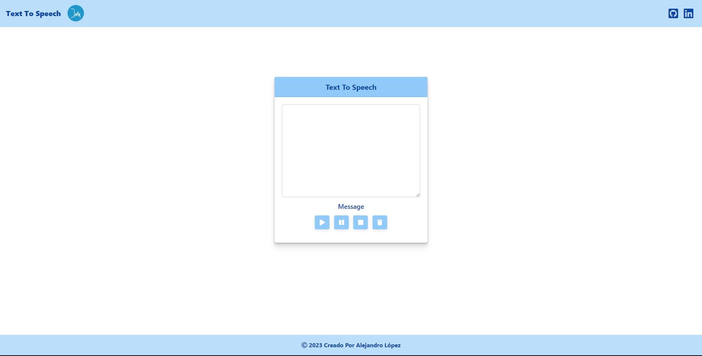

# <h1 align="center" style="color: #80cbc4;"> Text To Speech 👨🏻‍💻 </h1> 
  

` Text To Speech.` Speech synthesis is the artificial production of speech. The computerized system that is used for this purpose is called a speech computer or speech synthesizer and can be implemented in software or hardware products.

       

   

## 
 Requirements 

- [HTML5](https://developer.mozilla.org/es/docs/Web/HTML) 
- [CSS3](https://developer.mozilla.org/es/docs/Web/CSS)
- [JavaScript](https://developer.mozilla.org/es/docs/Web/JavaScript)
- [BootStrap](https://mdbootstrap.com/)

  

## 
 Screenshot Project 💻 

🔶 [Project Website](https://alejandro-lopez.futuretecware.com/Text-To-Speech/index.html)

